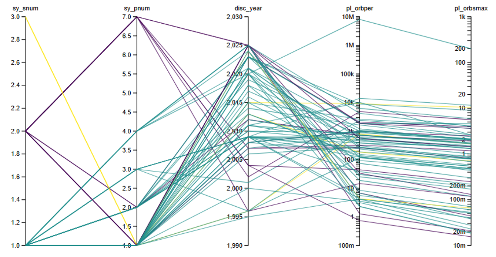

# InfoVis Exoplanets — Project Documentation

> **Interactive Information Visualization · SS26 · Technische Hochschule Nürnberg** 

| Student              | Mail                                                               |
|----------------------|--------------------------------------------------------------------|
| **Jonathan Kechter** | [kechterjo104919@th-nuernberg.de](kechterjo104919@th-nuernberg.de) |
| **Daniel Schweiger** | [schweigerda106609@th-nuernberg.de](schweigerda106609@th-nuernberg.de)     |
| **Laurin Kerntke**   | [kerntkela84836@th-nuernberg.de](kerntkela84836@th-nuernberg.de)   |

Link to the project repository: [https://github.com/Laurin-K/InfoVis-Exoplanets](https://github.com/Laurin-K/InfoVis-Exoplanets)

Link to the deployed web application: [https://laurin-k.github.io/InfoVis-Exoplanets/](https://laurin-k.github.io/InfoVis-Exoplanets/)

---

## 1. Project Overview

This project is an interactive web-based visualization tool for exploring the [NASA Exoplanet Archive](https://exoplanetarchive.ipac.caltech.edu/) dataset.
The application enables the users to explore thousands of exoplanets through multiple coordinated and standalone views built with **D3.js**.
The target user groups for this visualization are public audiences and students. 

The tool is structured around three functional modules:

| Module | Views |
|---|---|
| **Main Views** | Parallel Coordinate Plot, Spiderplot, Spiderplot Gallery, Scatterplot |
| **Interactive Labs** | Habitable Zone Explorer, Gravity Drop Simulator, Transit Light Curve Lab |
| **Utilities** | Planet Selector |

---

## 2. Final Design

### 2.1 Application Architecture

```
InfoVis-Exoplanets/
├── index.html                  # Landing page
├── pages/                      # HTML pages for every visualization
├── scripts/                    # D3.js visualization logic (JS)
├── styling/                    # CSS per page + shared base
└── data/                       # NASA CSV exports + Python processing scripts
```

### 2.2 Technology Stack

- **Frontend:** HTML5, CSS, JavaScript
- **Visualization:** [D3.js v7](https://d3js.org/)
- **Data Source:** NASA Exoplanet Archive (public API + CSV export)
- **Data Processing:** Python

### 2.3 Main Views

#### Parallel Coordinate Plot (`parallel-coordinate-plot.html`)
Displays multiple numeric dimensions as parallel vertical axes. 
Users are able to see trends or spot outliers for every two dimensions.

**Key functionality:**
- **Axis Selection:** Users can select which dimensions to show/hide via a control panel
- **Brushing:** Filtering method for each axis to narrow down the results; Lines outside the filter range are greyed out
- **Toggle reference planet:** Earth ↔ Jupiter unit toggle for mass and radius
- **Axis Scaling:** Axis are scaled based on user preference (Auto / Linear / Log), with per-axis LOG/LIN labels
- **Coloring** LCh equal-lightness color palettes
- **Hovering:** Highlights a single line; click selects the planet and shows an infocard
- **Missing Data:** Displayed in the chart with dashed lines; serves as line continuity 

**Quality of life:**
- Fullscreen chart toggle
- Reset buttons for all filters or per axis
- Glossary table with column names and explanations

#### Scatterplot (`scatterplot.html`)
Allows the comparison of 3 dimensions (including coloring). 
Users are able to see clusters or emerging patterns.

**Key functionality:**
- **Axis selection:** Users are able to select, change and flip axes 
- **Pan & Zoom** Panning and zooming interaction modes 
- **Overview & Detail:** Zoom + Overview window; The user is able to zoom into the scatterplot without losing orientation
- **Coloring:** Users are able to select different coloring options
- **Solar System overlay:** Adds all planets from the earth's solar system as reference points
- **Discovery Year slider** with Play animation (planets appear chronologically starting at 1992 up to 2026)

**Quality of life:**
- Reset Zoom button
- Planet infocard on click (with link to exoplanet archive)
- Data fields & definitions table at the bottom

#### Spiderplot (`spiderplot.html`)
Allows the comparison of 4 planets for up to 8 dimensions in a radial view.
Users are able to compare planets from the same planet system 

**Key functionality:**
- **Axis selection:** Users are able to add or remove axis for better comparison
- **Search:** Searching for planets by name, with live dropdown preview; can be limited to planets from 
- **Hover:** Hovering over one axis shows values with units
- **Visibility toggle:** per planet in the legend
- **Missing data:** "No Data" placeholder per axis (dashed lines) 

**Quality of life:**
- **Axes values visibility:** toggle to always on/off
- **Reposition axis:** order of the axes can be changes for specific needs
- **Adjust scaling:** either all log or all lin, depending on the users need

#### Spiderplot Gallery (`spiderplot-gallery.html`)
Grid view of individual spiderplots providing an overview of all planets.
Selecting one planet allows the user to dive deeper into the planets data with a familiar spider plot view.
Sorting is based on the planet system as mentioned in the expert feedback.

### 2.4 Additional views

#### Habitable Zone Explorer (`habitable-zone.html`)
- Visualizes habitable zone boundaries based on stellar properties
- Selection by planetary system (not individual planet)
- Shows which planets in a system fall within/outside the habitable zone

#### Gravity Drop Simulator (`gravity-drop.html`)
- Simulates dropping an object on different exoplanet surfaces
- Compares surface gravity across selected planets
- Playful/educational: shows drop time relative to Earth

#### Transit Light Curve Lab (`transit-lab.html`)
- Simulates the photometric dip as a planet transits its host star
- Y-axis is fixed; multiple transit profiles are overlaid for comparison
- Educational explanation of the transit detection method

#### Planet Selector (`planet-selector.html`)
- Utility tool to build a custom planet dataset for the other visualizations
- Filter and select planets by properties

---

## 3. Process

### 3.1 Initial Ideas, Sketches and Prototyping

At this stage, the following core views were proposed:
- Parallel Coordinate Plot (main multi-dimensional exploration tool)
- Spiderplot for individual planet comparisons
- Scatterplot for two-variable relationships
- Scatterplot Matrix (discussed but not pursued)
- Multiple Coordinated Views (discussed, evaluated)

Prototype:
- First Application prototype with a simple Parallel-Coordinate-Plot:
- Small sample of the NASA Exoplanet Archive

  

**Key open questions at Week 6:**
- What to do with incomplete/missing data rows?
- Who is the target audience? Researchers or students?
- Should a Scatterplot Matrix be added?
- Should a Spiderplot be added?
- Should Principal Component Analysis (PCA) be added as a dimension-reduction toggle?
- What is the design language (styling) going to be?

### 3.2 Early Implementation Milestones

| Date       | Development stage                   | Implemented functionality |
|------------|-------------------------------------|---|
| 2026-05-30 | Initial prototype (PCP)             | A first Parallel Coordinate Plot was implemented in a single HTML file using D3.js. It displayed five dimensions from a small NASA Exoplanet Archive dataset. |
| 2026-05-31 | Application structure               | The project was divided into a landing page, visualization pages, shared styling and a data directory. Placeholder pages for the Scatterplot and Spiderplot were introduced. The structure was subsequently adapted for deployment through GitHub Pages. |
| 2026-05-31 | Automatic axis scaling              | The Parallel Coordinate Plot received automatic scale selection. Dimensions spanning more than two orders of magnitude were displayed using logarithmic scales; other dimensions used linear scales. |
| 2026-05-31 | Configurable PCP axes               | Users could add or remove dimensions through dynamically generated checkboxes. The visualization was redrawn whenever the selection changed. |
| 2026-06-04 | PCP reference units and refactoring | Users could switch planetary mass and radius between Earth-based and Jupiter-based units. The visualization logic and styling were moved from the HTML file into separate JavaScript and CSS files. A glossary generated from `column_explanation.csv` was added. |
| 2026-06-04 | Multi-axis brushing                 | Vertical D3 brushes were added to every PCP axis. Multiple brush ranges could be combined to filter planets across several dimensions. |
| 2026-06-04 | First Scatterplot                   | A standalone Scatterplot Explorer was introduced. It supported selectable and swappable X/Y dimensions, automatic linear or logarithmic scaling, discovery-year coloring, hover tooltips and a data glossary. |
| 2026-06-04 | First Spiderplot                    | The first Spiderplot comparison view supported up to four planets and eight normalized metrics. It included planet search, initial example planets and a separate searchable gallery of individual spiderplots. |
| 2026-06-05 | PCP interaction improvements        | Tooltips for axis labels were added using the column glossary. Lines became clickable, allowing users to highlight a planet and display an information card. |
| 2026-06-07 | Unified visual design               | The landing page and Parallel Coordinate Plot received a shared visual language and more consistent page, control and chart styling. |

These milestones formed the first functional version of the application.

### 3.3 Feedback Round 1 - 2026-06-10

*Source: [`feedback/20260610-Feedback.md`](feedback/20260610-Feedback.md)*

| Topic | Feedback                                                                                         |
|---|--------------------------------------------------------------------------------------------------|
| General | "Missing insights": The app needs clearer takeaways                                              |
| General | Expert consultation required                                                                     |
| General | Incomplete data: show dashed lines for partial entries                                           |
| PCP | Fullscreen toggle for the chart                                                                  |
| PCP | PCA toggle option                                                                                |
| Scatterplot Matrix | Add it; click to focus                                                                           |
| Spiderplot | Better handling of NULL values; selectable dimensions                                            |
| Spiderplot Gallery | Show axis labels/values; selectable dimensions; filter; clustering; selection/overlap comparison |
| Multiple Coordinated Views | Evaluate whether to add                                                                          |

### 3.4 Feedback Round 2 - 2026-06-24

*Source: [`feedback/20260624-Feedback.md`](feedback/20260624-Feedback.md)*

**App purpose clarification:** Should the app focus on exploratory or expert work?

**User Study:** More intuitive operation for each plot; better visibility of toggles and selections.  

| Topic | Feedback | Implemented? |
|---|---|--------------|
| General | Add tutorial / help button | Yes            |
| PCP | Movable axes | Yes            |
| PCP | Make Earth/Jupiter toggle more visible | Yes            |
| PCP | Larger brush hit area + Reset brushing | Yes            |
| PCP | Tooltip for dimension names | Yes            |
| PCP | Fullscreen toggle | Yes            |
| Spiderplot | Live search preview in dropdown | Yes            |
| Spiderplot | Add planet directly on select | Yes            |
| Spiderplot | Hover tooltip with values | Yes            |
| Spiderplot | Eye-icon hide/show per planet | Yes            |
| Spiderplot | "No Data" per quadrant | Yes            |
| Scatterplot | Zoom into plot | Yes            |
| Scatterplot | Panning | Yes            |
| Scatterplot | More color options | Yes            |

### 3.5 Expert Feedback - 2026-06-31 (Laura von Zadow)

*Source: [`feedback/20260631-Feedback-Experte.md`](feedback/20260631-Feedback-Experte.md)*

**Key expert insight:** Target audience is public outreach (students/enthusiasts), not researchers.

| Topic          | Expert Feedback                                                 | Implemented? |
|----------------|-----------------------------------------------------------------|--------------|
| General        | Link planets to NASA exoplanet archive                          | Yes          |
| General        | "Multi-planet systems" visualization (system lines)             | No            |
| Spiderplot     | Show units on axis labels, not just on hover                    | Yes          |
| Spiderplot     | Disclaimer for missing data (with fallback to secondary dataset) | Yes          |
| Spiderplot     | Dimensions add/remove                                           | Yes          |
| Spiderplot     | Preload 2–4 demo planets                                        | Yes          |
| Scatterplot    | Solar System planets as reference points                        | Yes          |
| Scatterplot        | Default: Orbital Period (days) vs. Jupiter Radius               | Yes          |
| Scatterplot        | Discovery Year animation/timeline                               | Yes          |
| Scatterplot        | Filter/color by Discovery Method                                | Yes          |
| Scatterplot        | Click → planet infocard + link                                  | Yes          |
| Scatterplot        | Performance improvements                                        | Yes          |
| PCP            | LCh color space for equal-lightness palettes                    | Yes          |
| PCP            | Log/Linear labels per axis                                      | Yes          |
| PCP            | Interesting default dataset                                     | Yes          |
| Habitable Zone | Only show systems with multiple planets (orbit period ≥ 10 days) | Yes          |
| Gravity Drop   | Add to application, for public outreach                         | Yes          |
| Transit        | Stable Y-axis; show how drop changes                            | Yes          |

### 3.6 Feedback Round 3 - 2026-07-01

*Source: [`feedback/20260701-Feedback.md`](feedback/20260701-Feedback.md)*

| Topic | Feedback                                                       | Implemented? |
|---|----------------------------------------------------------------|--|
| General | Check all axis labels                                          | Yes |
| General | Add Solar System planets for context                           | Yes |
| PCP | Hover → better highlighting for one line, fade others          | Yes |
| PCP | Poor planet visibility when all lines are plotted              | Yes |
| PCP | LCh color space                                                | Yes |
| PCP | Log/Linear labels + toggle                                     | Yes |
| Spiderplot | Re-add example planets                                         | Yes |
| Spiderplot | Axes start fixed at 0                                          | Yes |
| Spiderplot | Avoid mixing log/linear scales                                 | Yes |

### 3.7 Feedback Implementation

Based on several feedback rounds with users and experts, the application was further refined. 
The collected comments and requirements were carefully evaluated and incorporated into the final implementation.

---

## 4. Design Rationale & Alternatives

### 4.1 Parallel Coordinate Plot
The NASA dataset has 30+ numeric columns.
PCP lets users see patterns across all dimensions simultaneously and filter interactively via brushing. 
Hard to achieve in a standard table.

**Alternative considered:** Spiderplot. Discussed in several feedbacks. Implemented as an alternative view.

### 4.2 Spiderplot
Ideal for comparing a small number of planets across normalized metrics at a glance.
Complements the PCP by focusing on individual planet profiles rather than trends.

### 4.3 Scatterplot
Ideal plot for finding clusters in the data.
Two modes (Pan and Box Zoom) let users navigate freely and also zoom precisely into dense clusters without losing context.

### 4.4 LCh Color Space
Standard HSL palettes produce colors of varying perceived brightness (purple appears much darker than yellow at the same lightness value).
LCh (Lightness-Chroma-Hue) keeps all hues perceptually equal-brightness, making every line visible regardless of value.
This was directly recommended by the expert and confirmed in the 2026-07-01 feedback.

---

## 5. Who Did What

Decisions were made collectively by the team.
Each view head was responsible for the oversight of the development and changes made by him or the team.
The development process was executed through the utilization of pair or team programming methodologies.
Every member of the team contributed equally to the success of the project.

| Member           | Contributions                                                |
|------------------|--------------------------------------------------------------|
| Laurin Kerntke   | Head of Parallel Coordinate Plot View                        |
| Jonathan Kechter | Head of Scatter Plot View, Planet selector, Interactive Labs |
| Daniel Schweiger | Head of Spider Plot View                                     |

---

## 6. Data

| File | Description |
|---|---|
| `nasa_export_large.csv` | Full NASA Exoplanet Archive export (~900 KB) |
| `nasa_export_small.csv` | Reduced export for fast loading (~15 KB) |
| `nasa_export_large_merged.csv` | Large export merged with secondary API data |
| `nasa_export_small_merged.csv` | Small export merged with secondary API data |
| `all_exoplanets_2021.csv` | Historical snapshot dataset (2021) |
| `api_only_export.csv` | Raw API export |
| `column_explanation.csv` | Human-readable descriptions of all data columns |
| `fetch_api_data.py` | Python script to fetch data from the NASA API |
| `merge_datasets.py` | Python script to merge/clean the datasets |
| `spiderplot-data.js` | Pre-processed JS data file for the spiderplot (~880 KB) |

---

## 7. Limitations

Items that were requested in feedback but not yet confirmed as implemented:

- [ ] Spiderplot Gallery: clarify purpose, might not get used as intended or serve a meaningful purpose
- [ ] PCP: improve single-planet visibility when all lines are rendered, handling of overlapping lines
- [ ] Scatterplot: performance improvements for large datasets
- [ ] "System comparison" visualization: Expert feedback: one line per system, planets on the line, user is able to see planets distances to each other and can compare those to other systems
